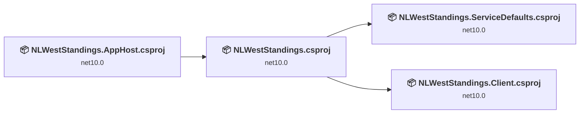
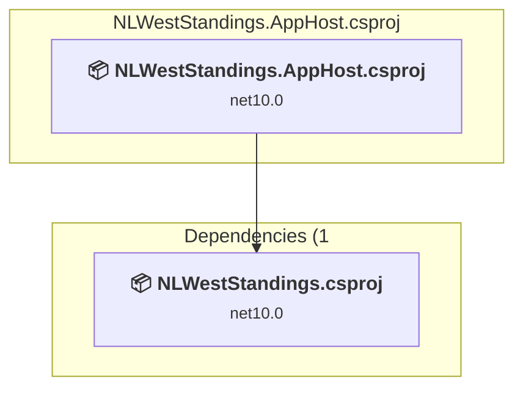
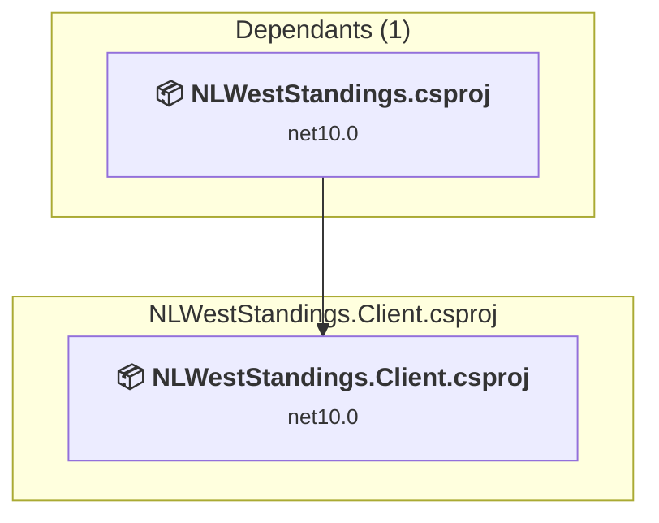
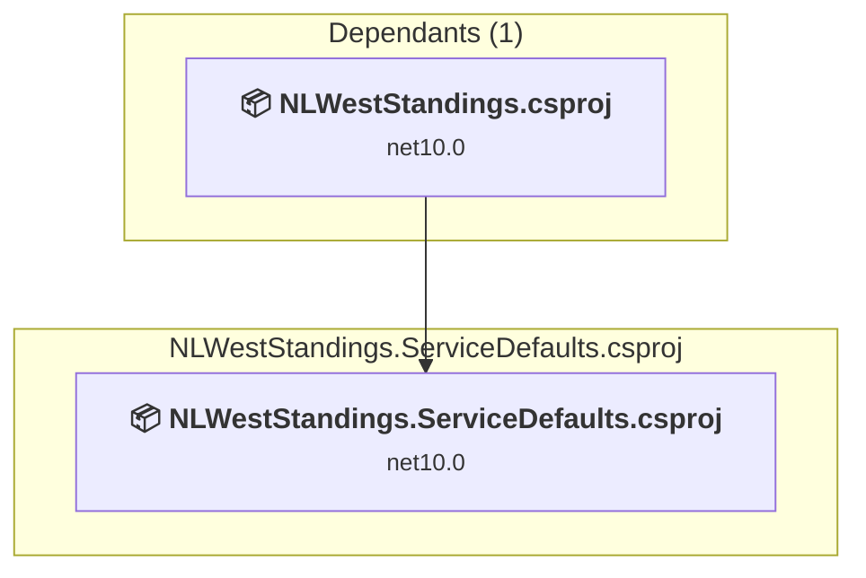
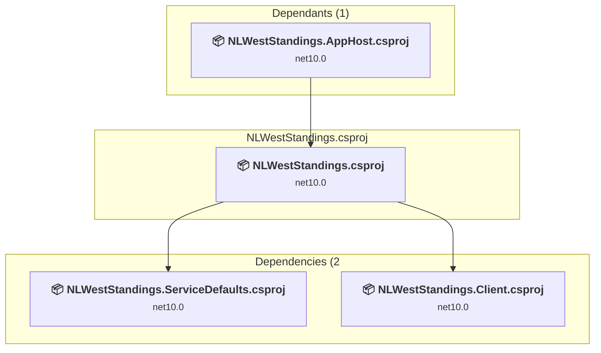

# Projects and dependencies analysis

This document provides a comprehensive overview of the projects and their dependencies in the context of upgrading to .NETCoreApp,Version=v10.0.

## Table of Contents

- [Executive Summary](#executive-Summary)
  - [Highlevel Metrics](#highlevel-metrics)
  - [Projects Compatibility](#projects-compatibility)
  - [Package Compatibility](#package-compatibility)
  - [API Compatibility](#api-compatibility)
- [Aggregate NuGet packages details](#aggregate-nuget-packages-details)
- [Top API Migration Challenges](#top-api-migration-challenges)
  - [Technologies and Features](#technologies-and-features)
  - [Most Frequent API Issues](#most-frequent-api-issues)
- [Projects Relationship Graph](#projects-relationship-graph)
- [Project Details](#project-details)

  - [NLWestStandings.AppHost\NLWestStandings.AppHost.csproj](#nlweststandingsapphostnlweststandingsapphostcsproj)
  - [NLWestStandings.Client\NLWestStandings.Client.csproj](#nlweststandingsclientnlweststandingsclientcsproj)
  - [NLWestStandings.ServiceDefaults\NLWestStandings.ServiceDefaults.csproj](#nlweststandingsservicedefaultsnlweststandingsservicedefaultscsproj)
  - [NLWestStandings\NLWestStandings.csproj](#nlweststandingsnlweststandingscsproj)

## Executive Summary

### Highlevel Metrics

| Metric | Count | Status |
| :--- | :---: | :--- |
| Total Projects | 4 | 0 require upgrade |
| Total NuGet Packages | 25 | All compatible |
| Total Code Files | 550 |  |
| Total Code Files with Incidents | 0 |  |
| Total Lines of Code | 144567 |  |
| Total Number of Issues | 0 |  |
| Estimated LOC to modify | 0+ | at least 0.0% of codebase |

### Projects Compatibility

| Project | Target Framework | Difficulty | Package Issues | API Issues | Est. LOC Impact | Description |
| :--- | :---: | :---: | :---: | :---: | :---: | :--- |
| [NLWestStandings.AppHost\NLWestStandings.AppHost.csproj](#nlweststandingsapphostnlweststandingsapphostcsproj) | net10.0 | ✅ None | 0 | 0 |  | DotNetCoreApp, Sdk Style = True |
| [NLWestStandings.Client\NLWestStandings.Client.csproj](#nlweststandingsclientnlweststandingsclientcsproj) | net10.0 | ✅ None | 0 | 0 |  | AspNetCore, Sdk Style = True |
| [NLWestStandings.ServiceDefaults\NLWestStandings.ServiceDefaults.csproj](#nlweststandingsservicedefaultsnlweststandingsservicedefaultscsproj) | net10.0 | ✅ None | 0 | 0 |  | ClassLibrary, Sdk Style = True |
| [NLWestStandings\NLWestStandings.csproj](#nlweststandingsnlweststandingscsproj) | net10.0 | ✅ None | 0 | 0 |  | AspNetCore, Sdk Style = True |

### Package Compatibility

| Status | Count | Percentage |
| :--- | :---: | :---: |
| ✅ Compatible | 25 | 100.0% |
| ⚠️ Incompatible | 0 | 0.0% |
| 🔄 Upgrade Recommended | 0 | 0.0% |
| ***Total NuGet Packages*** | ***25*** | ***100%*** |

### API Compatibility

| Category | Count | Impact |
| :--- | :---: | :--- |
| 🔴 Binary Incompatible | 0 | High - Require code changes |
| 🟡 Source Incompatible | 0 | Medium - Needs re-compilation and potential conflicting API error fixing |
| 🔵 Behavioral change | 0 | Low - Behavioral changes that may require testing at runtime |
| ✅ Compatible | 0 |  |
| ***Total APIs Analyzed*** | ***0*** |  |

## Aggregate NuGet packages details

| Package | Current Version | Suggested Version | Projects | Description |
| :--- | :---: | :---: | :--- | :--- |
| Aspire.Hosting.AppHost | 13.4.2 |  | [NLWestStandings.AppHost.csproj](#nlweststandingsapphostnlweststandingsapphostcsproj) | ✅Compatible |
| Blazored.LocalStorage | 4.5.0 |  | [NLWestStandings.Client.csproj](#nlweststandingsclientnlweststandingsclientcsproj) [NLWestStandings.csproj](#nlweststandingsnlweststandingscsproj) | ✅Compatible |
| Flurl | 4.0.0 |  | [NLWestStandings.Client.csproj](#nlweststandingsclientnlweststandingsclientcsproj) [NLWestStandings.csproj](#nlweststandingsnlweststandingscsproj) | ✅Compatible |
| Flurl.Http | 4.0.2 |  | [NLWestStandings.Client.csproj](#nlweststandingsclientnlweststandingsclientcsproj) [NLWestStandings.csproj](#nlweststandingsnlweststandingscsproj) | ✅Compatible |
| Heron.MudCalendar | 4.0.0 |  | [NLWestStandings.Client.csproj](#nlweststandingsclientnlweststandingsclientcsproj) [NLWestStandings.csproj](#nlweststandingsnlweststandingscsproj) | ✅Compatible |
| Microsoft.AspNetCore.Components.WebAssembly | 10.0.8 |  | [NLWestStandings.Client.csproj](#nlweststandingsclientnlweststandingsclientcsproj) | ✅Compatible |
| Microsoft.AspNetCore.Components.WebAssembly.Server | 10.0.8 |  | [NLWestStandings.csproj](#nlweststandingsnlweststandingscsproj) | ✅Compatible |
| Microsoft.AspNetCore.SignalR.Client | 10.0.8 |  | [NLWestStandings.Client.csproj](#nlweststandingsclientnlweststandingsclientcsproj) [NLWestStandings.csproj](#nlweststandingsnlweststandingscsproj) | ✅Compatible |
| Microsoft.Extensions.Http.Resilience | 10.6.0 |  | [NLWestStandings.ServiceDefaults.csproj](#nlweststandingsservicedefaultsnlweststandingsservicedefaultscsproj) | ✅Compatible |
| Microsoft.Extensions.ServiceDiscovery | 10.6.0 |  | [NLWestStandings.ServiceDefaults.csproj](#nlweststandingsservicedefaultsnlweststandingsservicedefaultscsproj) | ✅Compatible |
| Microsoft.VisualStudio.Azure.Containers.Tools.Targets | 1.23.0 |  | [NLWestStandings.csproj](#nlweststandingsnlweststandingscsproj) | ✅Compatible |
| morelinq | 4.4.0 |  | [NLWestStandings.csproj](#nlweststandingsnlweststandingscsproj) | ✅Compatible |
| MudBlazor | 9.5.0 |  | [NLWestStandings.Client.csproj](#nlweststandingsclientnlweststandingsclientcsproj) | ✅Compatible |
| Newtonsoft.Json | 13.0.4 |  | [NLWestStandings.Client.csproj](#nlweststandingsclientnlweststandingsclientcsproj) | ✅Compatible |
| OpenTelemetry.Exporter.OpenTelemetryProtocol | 1.15.3 |  | [NLWestStandings.ServiceDefaults.csproj](#nlweststandingsservicedefaultsnlweststandingsservicedefaultscsproj) | ✅Compatible |
| OpenTelemetry.Extensions.Hosting | 1.15.3 |  | [NLWestStandings.ServiceDefaults.csproj](#nlweststandingsservicedefaultsnlweststandingsservicedefaultscsproj) | ✅Compatible |
| OpenTelemetry.Instrumentation.AspNetCore | 1.15.2 |  | [NLWestStandings.ServiceDefaults.csproj](#nlweststandingsservicedefaultsnlweststandingsservicedefaultscsproj) | ✅Compatible |
| OpenTelemetry.Instrumentation.Http | 1.15.1 |  | [NLWestStandings.ServiceDefaults.csproj](#nlweststandingsservicedefaultsnlweststandingsservicedefaultscsproj) | ✅Compatible |
| OpenTelemetry.Instrumentation.Runtime | 1.15.1 |  | [NLWestStandings.ServiceDefaults.csproj](#nlweststandingsservicedefaultsnlweststandingsservicedefaultscsproj) | ✅Compatible |
| RestSharp | 114.0.0 |  | [NLWestStandings.Client.csproj](#nlweststandingsclientnlweststandingsclientcsproj) | ✅Compatible |
| Serilog | 4.3.1 |  | [NLWestStandings.csproj](#nlweststandingsnlweststandingscsproj) | ✅Compatible |
| Serilog.AspNetCore | 10.0.0 |  | [NLWestStandings.csproj](#nlweststandingsnlweststandingscsproj) | ✅Compatible |
| Serilog.Sinks.Async | 2.1.0 |  | [NLWestStandings.csproj](#nlweststandingsnlweststandingscsproj) | ✅Compatible |
| Serilog.Sinks.Console | 6.1.1 |  | [NLWestStandings.csproj](#nlweststandingsnlweststandingscsproj) | ✅Compatible |
| Websocket.Client | 5.5.0 |  | [NLWestStandings.Client.csproj](#nlweststandingsclientnlweststandingsclientcsproj) | ✅Compatible |

## Top API Migration Challenges

### Technologies and Features

| Technology | Issues | Percentage | Migration Path |
| :--- | :---: | :---: | :--- |

### Most Frequent API Issues

| API | Count | Percentage | Category |
| :--- | :---: | :---: | :--- |

## Projects Relationship Graph

Legend:
📦 SDK-style project
⚙️ Classic project

## Project Details

### NLWestStandings.AppHost\NLWestStandings.AppHost.csproj

#### Project Info

- **Current Target Framework:** net10.0✅
- **SDK-style**: True
- **Project Kind:** DotNetCoreApp
- **Dependencies**: 1
- **Dependants**: 0
- **Number of Files**: 1
- **Lines of Code**: 6
- **Estimated LOC to modify**: 0+ (at least 0.0% of the project)

#### Dependency Graph

Legend:
📦 SDK-style project
⚙️ Classic project

### API Compatibility

| Category | Count | Impact |
| :--- | :---: | :--- |
| 🔴 Binary Incompatible | 0 | High - Require code changes |
| 🟡 Source Incompatible | 0 | Medium - Needs re-compilation and potential conflicting API error fixing |
| 🔵 Behavioral change | 0 | Low - Behavioral changes that may require testing at runtime |
| ✅ Compatible | 0 |  |
| ***Total APIs Analyzed*** | ***0*** |  |

### NLWestStandings.Client\NLWestStandings.Client.csproj

#### Project Info

- **Current Target Framework:** net10.0✅
- **SDK-style**: True
- **Project Kind:** AspNetCore
- **Dependencies**: 0
- **Dependants**: 1
- **Number of Files**: 619
- **Lines of Code**: 144145
- **Estimated LOC to modify**: 0+ (at least 0.0% of the project)

#### Dependency Graph

Legend:
📦 SDK-style project
⚙️ Classic project

### API Compatibility

| Category | Count | Impact |
| :--- | :---: | :--- |
| 🔴 Binary Incompatible | 0 | High - Require code changes |
| 🟡 Source Incompatible | 0 | Medium - Needs re-compilation and potential conflicting API error fixing |
| 🔵 Behavioral change | 0 | Low - Behavioral changes that may require testing at runtime |
| ✅ Compatible | 0 |  |
| ***Total APIs Analyzed*** | ***0*** |  |

### NLWestStandings.ServiceDefaults\NLWestStandings.ServiceDefaults.csproj

#### Project Info

- **Current Target Framework:** net10.0✅
- **SDK-style**: True
- **Project Kind:** ClassLibrary
- **Dependencies**: 0
- **Dependants**: 1
- **Number of Files**: 1
- **Lines of Code**: 119
- **Estimated LOC to modify**: 0+ (at least 0.0% of the project)

#### Dependency Graph

Legend:
📦 SDK-style project
⚙️ Classic project

### API Compatibility

| Category | Count | Impact |
| :--- | :---: | :--- |
| 🔴 Binary Incompatible | 0 | High - Require code changes |
| 🟡 Source Incompatible | 0 | Medium - Needs re-compilation and potential conflicting API error fixing |
| 🔵 Behavioral change | 0 | Low - Behavioral changes that may require testing at runtime |
| ✅ Compatible | 0 |  |
| ***Total APIs Analyzed*** | ***0*** |  |

### NLWestStandings\NLWestStandings.csproj

#### Project Info

- **Current Target Framework:** net10.0✅
- **SDK-style**: True
- **Project Kind:** AspNetCore
- **Dependencies**: 2
- **Dependants**: 1
- **Number of Files**: 17
- **Lines of Code**: 297
- **Estimated LOC to modify**: 0+ (at least 0.0% of the project)

#### Dependency Graph

Legend:
📦 SDK-style project
⚙️ Classic project

### API Compatibility

| Category | Count | Impact |
| :--- | :---: | :--- |
| 🔴 Binary Incompatible | 0 | High - Require code changes |
| 🟡 Source Incompatible | 0 | Medium - Needs re-compilation and potential conflicting API error fixing |
| 🔵 Behavioral change | 0 | Low - Behavioral changes that may require testing at runtime |
| ✅ Compatible | 0 |  |
| ***Total APIs Analyzed*** | ***0*** |  |

